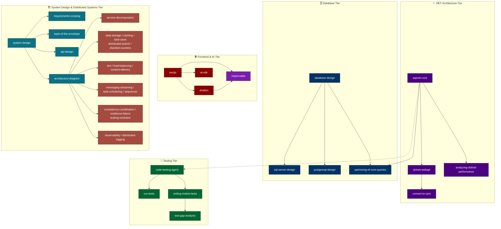

# 🤖 My Skills AI

Professional Enterprise Repository for AI Coding Assistant configurations, shared skills, rules, and plugins (Codex & Gemini Antigravity).

---

## 🏷️ Tags Index (ค้นตามหมวดแท็ก)

กดที่ Tag เพื่อกระโดดไปยังกลุ่มสกิลในตารางค้นหาด่วน:

[🏷️ `#Database`](#tag-database) | [🏷️ `#DotNet`](#tag-dotnet) | [🏷️ `#Performance`](#tag-performance) | [🏷️ `#Testing`](#tag-testing) | [🏷️ `#MSBuild`](#tag-msbuild) | [🏷️ `#System-Design`](#tag-system-design) | [🏷️ `#Distributed-Systems`](#tag-distributed-systems) | [🏷️ `#Frontend`](#tag-frontend) | [🏷️ `#Design`](#tag-design) | [🏷️ `#DevOps`](#tag-devops) | [🏷️ `#AI-Agents`](#tag-ai-agents)

---

## 📚 Quick Index / Categories

* [🗄️ Database Design](#1-database-design)
* [⚡ .NET Architecture & Performance](#2-net-architecture--performance)
* [🧪 Testing & Code Quality](#3-testing--code-quality)
* [📦 MSBuild & Dependency Management](#4-msbuild--dependency-management)
* [🚀 Upgrades & Migrations](#5-upgrades--migrations)
* [🌐 Frontend, UX/UI & Cloud (Vercel / Next.js)](#6-frontend--cloud-vercel--nextjs)
* [🏗️ System Design & Distributed Systems](#7-system-design--distributed-systems)
* [🤖 AI & Agent Frameworks](#8-ai--agent-frameworks)
* [📄 Artifact Templates & Documents](#9-artifact-templates--documents)

---

## 🔍 Quick Search Table (ตารางค้นหาด่วน)

| ถ้าจะทำ / เทคโนโลยีที่ใช้ | ใช้ Skill นี้ | Category | Tag |
| :--- | :--- | :--- | :--- |
| <a id="tag-database"></a>**SQL Server (T-SQL)** | `sql-server-design` | Database | `#Database` |
| **PostgreSQL** | `postgresql-design` | Database | `#Database` |
| **Enterprise Database Architecture (DDD / Normalization)** | `database-design` | Database | `#Database` |
| **EF Core Optimization (N+1 / Tracking / Compiled)** | `optimizing-ef-core-queries` | Database | `#Database` |
| **Supabase (Database / Auth / Realtime / RLS)** | `supabase`, `supabase-postgres-best-practices` | Database | `#Database` |
| <a id="tag-dotnet"></a>**ASP.NET Core Web API / Blazor / MVC** | `aspnet-core`, `dotnet-webapi` | .NET Architecture | `#DotNet` |
| <a id="tag-performance"></a>**.NET Performance Analysis & Anti-patterns** | `analyzing-dotnet-performance` | Performance | `#Performance` |
| **Benchmark (.NET BenchmarkDotNet)** | `microbenchmarking` | Performance | `#Performance` |
| <a id="tag-testing"></a>**Unit Testing & Test Generation (Polyglot)** | `code-testing-agent` | Testing | `#Testing` |
| **Run .NET Tests (VSTest / MTP)** | `run-tests` | Testing | `#Testing` |
| **MSTest Authoring & Modernization** | `writing-mstest-tests` | Testing | `#Testing` |
| <a id="tag-msbuild"></a>**Central Package Management (CPM)** | `convert-to-cpm` | MSBuild | `#MSBuild` |
| **MSBuild Infrastructure & Props/Targets** | `directory-build-organization` | MSBuild | `#MSBuild` |
| **.NET Upgrade (8 ➔ 9 ➔ 10 ➔ 11)** | `migrate-dotnet8-to-dotnet9`, `migrate-dotnet9-to-dotnet10`, `migrate-dotnet10-to-dotnet11` | Upgrades | `#DotNet` |
| <a id="tag-system-design"></a>**ออกแบบระบบตั้งแต่ Requirements ถึง Architecture Diagram** | `system-design`, `requirements-scoping`, `back-of-the-envelope`, `architecture-diagram` | System Design | `#System-Design` |
| **ออกแบบ API และแบ่ง Service Boundaries** | `api-design`, `service-decomposition` | Architecture | `#System-Design` |
| **เลือก Data Store / Cache / Blob Storage / Search** | `data-storage`, `caching`, `blob-store`, `distributed-search` | Data Architecture | `#System-Design` |
| <a id="tag-distributed-systems"></a>**Queue / Streaming / Scheduled Jobs / Distributed IDs** | `messaging-streaming`, `task-scheduling`, `sequencer` | Distributed Systems | `#Distributed-Systems` |
| **Consistency / Consensus / Distributed Transactions** | `consistency-coordination` | Distributed Systems | `#Distributed-Systems` |
| **DNS / Load Balancing / CDN และ Multi-region Traffic** | `dns`, `load-balancing`, `content-delivery` | Traffic & Edge | `#Distributed-Systems` |
| **Resilience / Scaling / Hot Counters** | `resilience-failure`, `scaling-evolution`, `sharded-counters` | Reliability & Scale | `#Distributed-Systems` |
| **Observability และ Centralized Logging** | `observability`, `distributed-logging` | Operations | `#Distributed-Systems` |
| <a id="tag-frontend"></a>**Next.js (App Router / PPR / Caching)** | `nextjs`, `next-upgrade`, `next-cache-components` | Frontend | `#Frontend` |
| **React UI Components & Best Practices** | `shadcn`, `react-best-practices`, `geist` | Frontend | `#Frontend` |
| <a id="tag-design"></a>**ออกแบบ / Redesign / Polish หน้าเว็บและ Product UI** | `impeccable` | UX/UI Design | `#Design` |
| **UX Critique / Accessibility / Responsive / UI Performance Audit** | `impeccable`, `agent-browser-verify` | UX/UI Quality | `#Design` |
| **ทดลอง UI Variants แบบ Live ใน Browser** | `impeccable`, `agent-browser` | Interactive Design | `#Design` |
| <a id="tag-devops"></a>**Vercel CLI / Deployment / Functions** | `vercel-cli`, `vercel-functions`, `deployments-cicd` | DevOps | `#DevOps` |
| <a id="tag-ai-agents"></a>**AI SDK & AI Gateways** | `ai-sdk`, `ai-gateway`, `ai-elements` | AI Frameworks | `#AI-Agents` |

---

## 🌲 Skill Dependency & Co-usage Graph (แผนผังความเชื่อมโยงของ สกิล)



---

## 📌 Repository Architecture (Shared Skills Structure)

คลังนี้ใช้โครงสร้างแบบ **Shared Repository** เพื่อให้ AI ทุกตัว (Codex และ Gemini) ใช้งานชุดความรู้เดียวกัน ป้องกันการแก้ไขซ้ำซ้อน:

```text
my-skills-ai/
├── 🤝 shared/           # 🌟 ศูนย์กลางความรู้ร่วม (Single Source of Truth)
│   ├── 📜 rules/        # กฎเหล็กในการเขียนโค้ด (csharp-style.md, aspnet-core-auto.md, default.rules)
│   └── 🧠 skills/       # ชุดความรู้และคู่มือเทคโนโลยีทั้งหมด 217+ Skills
│
├── 🤖 codex/            # การตั้งค่าเฉพาะทางของ Codex App
│   ├── 📄 AGENTS.md     # System Prompts หลักของ Codex
│   ├── ⚙️ config.toml   # ไฟล์ตั้งค่าระบบ (MCP Servers, Theme, Plugins)
│   ├── 🐶 pets/         # Mascot & Avatar (Buddy)
│   └── 🧩 plugins/      # ปลั๊กอินเฉพาะทาง (19 Plugins)
│
└── ♊ gemini/           # การตั้งค่าเฉพาะทางของ Gemini Antigravity
```

---

## 🛠️ Category Details & Skill Metadata

<a id="1-database-design"></a>
### 🗄️ 1. Database Design
* **`database-design`**
  - **Category:** Database Design & Architecture
  - **Use When:** ออกแบบ enterprise database schema, DDD entity modeling, 3NF/BCNF normalization, partitioning strategy
  - **Avoid When:** ต้องการเขียน query ปรับแต่งประสิทธิภาพเฉพาะเครื่องยนต์ database เช่น SQL Server หรือ Postgres
  - **Related Skills:** `sql-server-design`, `postgresql-design`, `optimizing-ef-core-queries`

* **`sql-server-design`**
  - **Category:** Database Engine (MS SQL Server)
  - **Use When:** เขียน T-SQL DDL, ตั้งค่า Temporal Tables, Filtered Index, Columnstore, Row-Level Security (RLS)
  - **Avoid When:** ใช้ฐานข้อมูล PostgreSQL หรือ NoSQL
  - **Related Skills:** `database-design`, `optimizing-ef-core-queries`

* **`postgresql-design`**
  - **Category:** Database Engine (PostgreSQL)
  - **Use When:** ออกแบบ PostgreSQL DDL, ชนิดข้อมูล JSONB/GIN, UUIDv7, BRIN Indexing, Table Partitioning
  - **Avoid When:** ใช้ฐานข้อมูล Microsoft SQL Server
  - **Related Skills:** `database-design`, `supabase-postgres-best-practices`

* **`optimizing-ef-core-queries`**
  - **Category:** ORM Query Optimization
  - **Use When:** EF Core Queries ช้า, เกิดปัญหา N+1, ต้องการเลือก Tracking Mode หรือ Compiled Queries
  - **Avoid When:** ใช้ Dapper หรือ SQL Direct แบบไม่ผ่าน EF Core
  - **Related Skills:** `sql-server-design`, `postgresql-design`

---

<a id="2-net-architecture--performance"></a>
### ⚡ 2. .NET Architecture & Performance
* **`aspnet-core`**
  - **Category:** Web Application Architecture
  - **Use When:** สร้าง/จัดโครงสร้าง Blazor, Minimal APIs, MVC, SignalR, gRPC, Middleware & Dependency Injection
  - **Avoid When:** งานสคริปต์ C# แผ่นเดียว หรือการเขียนแค่ตัวรัน Test
  - **Related Skills:** `dotnet-webapi`, `analyzing-dotnet-performance`

* **`analyzing-dotnet-performance`**
  - **Category:** Code Performance Audit
  - **Use When:** รีวิว hot path, ตรวจสแกนหาจุดอับประสิทธิภาพใน .NET (Async, Allocations, LINQ, Regex)
  - **Avoid When:** ต้องการเครื่องวัด microbenchmarking เฉพาะตัว (ใช้ `microbenchmarking` แทน)
  - **Related Skills:** `microbenchmarking`, `build-perf-diagnostics`

---

<a id="3-testing--code-quality"></a>
### 🧪 3. Testing & Code Quality
* **`code-testing-agent`**
  - **Category:** Test Generation Entrypoint
  - **Use When:** ต้องการสร้าง Unit Test ใหม่, เพิ่ม Coverage, สแคฟโฟลด์ Test project (รองรับ C#, Python, TS, Go)
  - **Avoid When:** ต้องการเพียงรัน Test ที่มีอยู่แล้ว (ใช้ `run-tests` แทน)
  - **Related Skills:** `run-tests`, `writing-mstest-tests`, `test-anti-patterns`

* **`run-tests`**
  - **Category:** Test Execution & Diagnostics
  - **Use When:** รัน `dotnet test` ด้วยฟิลเตอร์เฉพาะ, สลับระหว่าง VSTest กับ MTP (Microsoft.Testing.Platform)
  - **Avoid When:** ต้องการเขียนโค้ด Test ใหม่
  - **Related Skills:** `code-testing-agent`, `writing-mstest-tests`

---

<a id="4-msbuild--dependency-management"></a>
### 📦 4. MSBuild & Dependency Management
* **`directory-build-organization`**
  - **Category:** Solution Build Architecture
  - **Use When:** รวมศูนย์การตั้งค่า Build ด้วย `Directory.Build.props` / `Directory.Build.targets`
  - **Related Skills:** `convert-to-cpm`, `msbuild-modernization`

* **`convert-to-cpm`**
  - **Category:** Dependency Management
  - **Use When:** รวมศูนย์เวอร์ชัน NuGet Packages ในโซลูชันด้วย `Directory.Packages.props` (CPM)
  - **Related Skills:** `directory-build-organization`

---

<a id="5-upgrades--migrations"></a>
### 🚀 5. Upgrades & Migrations
* **`migrate-dotnet8-to-dotnet9` / `migrate-dotnet9-to-dotnet10` / `migrate-dotnet10-to-dotnet11`**
  - **Category:** Target Framework Migration
  - **Use When:** อัปเกรดเวอร์ชัน .NET Target Framework และแก้ไข Breaking Changes ตามเวอร์ชัน

---

<a id="6-frontend--cloud-vercel--nextjs"></a>
### 🌐 6. Frontend, UX/UI & Cloud (Vercel / Next.js)
* **`nextjs`**: พัฒนา Next.js App Router, Server Components & PPR
* **`shadcn`**: พัฒนา UI Components ด้วย shadcn/ui & Tailwind CSS

* **`impeccable`** (v4.0.4)
  - **Category:** End-to-End UX/UI Design, Review & Frontend Craft
  - **Use When:** ออกแบบหรือ redesign เว็บไซต์, landing page, dashboard, product UI, app shell, component, form, settings, onboarding และ empty state รวมถึงงาน critique, audit, polish, accessibility, responsive, performance, design system, typography, color, motion และ UX copy
  - **Avoid When:** เป็นงาน backend-only, infrastructure หรือ task ที่ไม่เกี่ยวข้องกับ UI
  - **Design Modes:** `Persuade` สำหรับหน้า marketing/ขาย, `Operate` สำหรับแอปและเครื่องมือ, `Read` สำหรับ docs/บทความ และ `Experience` สำหรับ portfolio/gallery
  - **Standard Workflow:** โหลด project context หนึ่งครั้งด้วย `scripts/context.mjs`, เลือก playbook ให้ตรงงาน, ตรวจ design tokens/components เดิม และใช้ `reference/craft-floor.md` เป็น quality floor ก่อนแก้ UI
  - **Project Artifacts:** ใช้ `PRODUCT.md`, `DESIGN.md` และ surface brief เพื่อเก็บ product truth, visual system และข้อกำหนดเฉพาะแต่ละหน้าให้ AI ทำงานต่อเนื่องโดยไม่หลุดแบรนด์
  - **Quality Gate:** ตรวจ desktop และ mobile เป็นรอบแบบมีขอบเขต แก้ defect เป็นชุด และยืนยันผลไม่เกินหนึ่งรอบเพิ่มเติม
  - **Plan & Build:** `init`, `shape`, `document`, `extract` (`craft` เป็น alias เดิมสำหรับงาน new-work)
  - **Evaluate:** `critique`, `audit`
  - **Refine:** `polish`, `bolder`, `quieter`, `distill`, `harden`, `onboard`
  - **Enhance:** `animate`, `colorize`, `typeset`, `layout`, `delight`, `overdrive`
  - **Fix:** `clarify`, `adapt`, `optimize`
  - **Interactive Iteration:** `live` สำหรับเลือก element และทดลอง UI variants ใน browser แบบ real time
  - **Maintenance & Shortcuts:** `doctor` ตรวจ artifact/config drift, `hooks` เปิด detector หลังแก้ไฟล์ UI และ `pin`/`unpin` สร้างหรือลบ shortcut ของคำสั่ง
  - **Related Skills:** `nextjs`, `shadcn`, `react-best-practices`, `agent-browser`, `agent-browser-verify`

---

<a id="7-system-design--distributed-systems"></a>
### 🏗️ 7. System Design & Distributed Systems

ชุดสกิลนี้ครอบคลุมวงจรออกแบบระบบตั้งแต่การตีโจทย์ ประเมิน scale เลือก architecture และ building blocks ไปจนถึงการวิเคราะห์ failure modes โดยใช้ `system-design` เป็น orchestrator แล้วเรียกสกิลเฉพาะทางตามการตัดสินใจที่เกิดขึ้น

**Core Design Workflow**

* **`system-design`**
  - **Role:** Orchestrator สำหรับโจทย์ออกแบบระบบแบบปลายเปิด
  - **Use When:** ออกแบบ product/service, high-level architecture หรือเตรียม system design interview
  - **Workflow:** Clarify → Estimate → Design → Compare Trade-offs → Stress-test → Iterate
  - **Routes To:** `requirements-scoping`, `back-of-the-envelope`, `api-design`, `architecture-diagram` และ building-block skills อื่นตามความจำเป็น

* **`requirements-scoping`**: แยก functional requirements, non-functional constraints และ out-of-scope จากโจทย์ที่ยังคลุมเครือ
* **`back-of-the-envelope`**: ประเมิน QPS, peak load, storage, bandwidth, server count และ capacity เพื่อให้การเลือก architecture มีตัวเลขรองรับ
* **`api-design`**: กำหนด REST/gRPC/GraphQL/WebSocket contract, request-response schema, pagination, idempotency, errors และ versioning
* **`architecture-diagram`**: สร้างแผนภาพ architecture/data flow/failure path แบบ HTML + SVG พร้อม export PNG/PDF

**Service, Data & Traffic Architecture**

* **`service-decomposition`**: ตัดสินใจ monolith vs microservices, service boundaries, granularity, API Gateway/BFF, discovery และ service mesh
* **`data-storage`**: เลือก SQL/NoSQL, data model, index, partition/shard key, replication และ polyglot persistence
* **`caching`**: ออกแบบ read-through/write-through/write-back, TTL, eviction และรับมือ stampede, penetration หรือ hot keys
* **`blob-store`**: ออกแบบ object storage สำหรับไฟล์ขนาดใหญ่, multipart/resumable upload, signed URL, versioning และ storage tiering
* **`distributed-search`**: ออกแบบ full-text search, inverted index, BM25, autocomplete, indexing pipeline, sharding และ replication
* **`dns`**: ออกแบบ global name resolution, GeoDNS, latency/weighted/failover routing, Anycast และ TTL strategy
* **`load-balancing`**: เลือก L4/L7, balancing algorithm, health checks, sticky sessions, reverse proxy และ TLS termination
* **`content-delivery`**: ออกแบบ CDN/edge caching, POP selection, origin shield, Cache-Control และ delivery สำหรับ static/media content

**Asynchronous Work, Coordination & Scale**

* **`messaging-streaming`**: ออกแบบ queue, pub/sub, Kafka/RabbitMQ/SQS/Kinesis, delivery guarantees, ordering, deduplication, DLQ และ backpressure
* **`task-scheduling`**: ออกแบบ cron/delayed/recurring jobs, worker pool, leasing, visibility timeout, priority, fairness และ task idempotency
* **`consistency-coordination`**: เลือก consistency model ด้วย CAP/PACELC, quorum, consensus, leader election, 2PC หรือ saga
* **`sequencer`**: เลือก UUID/ULID, Snowflake ID หรือ ticket/range allocator สำหรับ ID ที่ unique, sortable หรือ monotonic
* **`sharded-counters`**: รองรับ like/view/vote counters ที่มี write contention สูงด้วย sharding หรือ approximate counting เช่น HyperLogLog
* **`scaling-evolution`**: วาง scaling roadmap จาก single server ไปสู่ tiers, replicas, cache, CDN, stateless services, multi-region และ sharding ตาม bottleneck จริง

**Reliability & Operations**

* **`resilience-failure`**: ออกแบบ timeout, retry with jitter, circuit breaker, bulkhead, rate limiting, failover และ graceful degradation
* **`observability`**: กำหนด metrics/logs/traces, health checks, SLI/SLO, error budgets, RED/USE dashboards และ alerting
* **`distributed-logging`**: ออกแบบ collect → buffer → ship → index → store → retain pipeline พร้อม correlation IDs, sampling และ cold-storage tiering

**Provider References:** building-block skills มี deep-dive และ mapping สำหรับ AWS, Azure, GCP และ generic architecture; บางหัวข้อมี Temporal guidance สำหรับ durable workflows และ orchestration

---

<a id="8-ai--agent-frameworks"></a>
### 🤖 8. AI & Agent Frameworks
* **`ai-sdk`**: พัฒนา AI Features, Streaming, Tool Calling ด้วย Vercel AI SDK

---

<a id="9-artifact-templates--documents"></a>
### 📄 9. Artifact Templates & Documents
* **`documents` / `pdf` / `presentations` / `spreadsheets`**: สร้างและจัดการเอกสาร Word, PDF, Slide และ Excel

---

## 🚀 How to Sync / Use on a New Machine

เมื่อนำไปใช้กับเครื่องใหม่ ให้ดึงไฟล์จากโฟลเดอร์ `shared/` ไปใช้งาน:

### 1. นำไปใส่ Codex App:
```powershell
# Copy Shared Skills & Rules
Copy-Item -Path ".\shared\skills\*" -Destination "$env:USERPROFILE\.codex\skills\" -Recurse -Force
Copy-Item -Path ".\shared\rules\*" -Destination "$env:USERPROFILE\.codex\rules\" -Recurse -Force

# Copy Codex Specific Configs, Plugins & Mascot
Copy-Item -Path ".\codex\plugins\*" -Destination "$env:USERPROFILE\.codex\plugins\" -Recurse -Force
Copy-Item -Path ".\codex\AGENTS.md", ".\codex\config.toml" -Destination "$env:USERPROFILE\.codex\" -Force
Copy-Item -Path ".\codex\pets\*" -Destination "$env:USERPROFILE\.codex\pets\" -Recurse -Force
```

### 2. นำไปใส่ Gemini Antigravity:
```powershell
# Copy Shared Skills & Rules
Copy-Item -Path ".\shared\skills\*" -Destination "$env:USERPROFILE\.gemini\config\skills\" -Recurse -Force
Copy-Item -Path ".\shared\rules\*" -Destination "$env:USERPROFILE\.gemini\config\rules\" -Recurse -Force
```

---

*Updated: August 2026*
