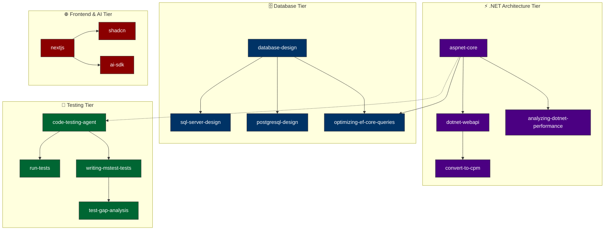

# 🤖 My Skills AI

Professional Enterprise Repository for AI Coding Assistant configurations, shared skills, rules, and plugins (Codex & Gemini Antigravity).

---

## 🏷️ Tags Index (ค้นตามหมวดแท็ก)

กดที่ Tag เพื่อกระโดดไปยังกลุ่มสกิลตามสายงาน:

[🏷️ `#DotNet`](#tag-dotnet) | [🏷️ `#Database`](#tag-database) | [🏷️ `#AI-Agents`](#tag-ai-agents) | [🏷️ `#Performance`](#tag-performance) | [🏷️ `#Testing`](#tag-testing) | [🏷️ `#DevOps`](#tag-devops) | [🏷️ `#Frontend`](#tag-frontend) | [🏷️ `#Documents`](#tag-documents)

---

### 📌 Tag Details

<a id="tag-dotnet"></a>
* **`#DotNet`**: `aspnet-core`, `dotnet-webapi`, `analyzing-dotnet-performance`, `microbenchmarking`, `dotnet-aot-compat`, `directory-build-organization`, `convert-to-cpm`

<a id="tag-database"></a>
* **`#Database`**: `database-design`, `sql-server-design`, `postgresql-design`, `optimizing-ef-core-queries`, `supabase`, `supabase-postgres-best-practices`

<a id="tag-ai-agents"></a>
* **`#AI-Agents`**: `ai-sdk`, `ai-gateway`, `ai-elements`, `chat-sdk`, `json-render`, `eve`, `v0-dev`

<a id="tag-performance"></a>
* **`#Performance`**: `analyzing-dotnet-performance`, `build-perf-diagnostics`, `microbenchmarking`, `cdn-caching`, `runtime-cache`

<a id="tag-testing"></a>
* **`#Testing`**: `code-testing-agent`, `run-tests`, `writing-mstest-tests`, `test-anti-patterns`, `assertion-quality`, `test-gap-analysis`

<a id="tag-devops"></a>
* **`#DevOps`**: `deployments-cicd`, `env-vars`, `cron-jobs`, `vercel-cli`, `nuget-trusted-publishing`

<a id="tag-frontend"></a>
* **`#Frontend`**: `nextjs`, `shadcn`, `react-best-practices`, `geist`, `satori`, `swr`

<a id="tag-documents"></a>
* **`#Documents`**: `documents`, `pdf`, `presentations`, `spreadsheets`, `artifact-template-system-design`

---

## 📚 Quick Index / Categories

* [🗄️ Database Design](#1-database-design)
* [⚡ .NET Architecture & Performance](#2-net-architecture--performance)
* [🧪 Testing & Code Quality](#3-testing--code-quality)
* [📦 MSBuild & Dependency Management](#4-msbuild--dependency-management)
* [🚀 Upgrades & Migrations](#5-upgrades--migrations)
* [🌐 Frontend & Cloud (Vercel / Next.js)](#6-frontend--cloud-vercel--nextjs)
* [🤖 AI & Agent Frameworks](#7-ai--agent-frameworks)
* [📄 Artifact Templates & Documents](#8-artifact-templates--documents)

---

## 🔍 Quick Search Table (ตารางค้นหาด่วน)

| ถ้าจะทำ / เทคโนโลยีที่ใช้ | ใช้ Skill นี้ | Category | Tag |
| :--- | :--- | :--- | :--- |
| **SQL Server (T-SQL)** | `sql-server-design` | Database | `#Database` |
| **PostgreSQL** | `postgresql-design` | Database | `#Database` |
| **Enterprise Database Architecture (DDD / Normalization)** | `database-design` | Database | `#Database` |
| **EF Core Optimization (N+1 / Tracking / Compiled)** | `optimizing-ef-core-queries` | Database | `#Database` |
| **Supabase (Database / Auth / Realtime / RLS)** | `supabase`, `supabase-postgres-best-practices` | Database | `#Database` |
| **ASP.NET Core Web API / Blazor / MVC** | `aspnet-core`, `dotnet-webapi` | .NET Architecture | `#DotNet` |
| **.NET Performance Analysis & Anti-patterns** | `analyzing-dotnet-performance` | Performance | `#Performance` |
| **Benchmark (.NET BenchmarkDotNet)** | `microbenchmarking` | Performance | `#Performance` |
| **Unit Testing & Test Generation (Polyglot)** | `code-testing-agent` | Testing | `#Testing` |
| **Run .NET Tests (VSTest / MTP)** | `run-tests` | Testing | `#Testing` |
| **MSTest Authoring & Modernization** | `writing-mstest-tests` | Testing | `#Testing` |
| **Central Package Management (CPM)** | `convert-to-cpm` | MSBuild | `#DotNet` |
| **MSBuild Infrastructure & Props/Targets** | `directory-build-organization` | MSBuild | `#DotNet` |
| **.NET Upgrade (8 ➔ 9 ➔ 10 ➔ 11)** | `migrate-dotnet8-to-dotnet9`, `migrate-dotnet9-to-dotnet10`, `migrate-dotnet10-to-dotnet11` | Upgrades | `#DotNet` |
| **Next.js (App Router / PPR / Caching)** | `nextjs`, `next-upgrade`, `next-cache-components` | Frontend | `#Frontend` |
| **React UI Components & Best Practices** | `shadcn`, `react-best-practices`, `geist` | Frontend | `#Frontend` |
| **Vercel CLI / Deployment / Functions** | `vercel-cli`, `vercel-functions`, `deployments-cicd` | DevOps | `#DevOps` |
| **AI SDK & AI Gateways** | `ai-sdk`, `ai-gateway`, `ai-elements` | AI Frameworks | `#AI-Agents` |

---

## 🌲 Skill Dependency & Co-usage Graph (แผนผังความเชื่อมโยงของ สกิล)



---

## 📌 Repository Architecture (Shared Skills Structure)

คลังนี้ใช้โครงสร้างแบบ **Shared Repository** เพื่อให้ AI ทุกตัว (Codex และ Gemini) ใช้งานชุดความรู้เดียวกัน ป้องกันการแก้ไขซ้ำซ้อน:

```text
my-skills-ai/
├── 🤝 shared/           # 🌟 ศูนย์กลางความรู้ร่วม (Single Source of Truth)
│   ├── 📜 rules/        # กฎเหล็กในการเขียนโค้ด (csharp-style.md, aspnet-core-auto.md, default.rules)
│   └── 🧠 skills/       # ชุดความรู้และคู่มือเทคโนโลยีทั้งหมด 195+ Skills
│
├── 🤖 codex/            # การตั้งค่าเฉพาะทางของ Codex App
│   ├── 📄 AGENTS.md     # System Prompts หลักของ Codex
│   ├── ⚙️ config.toml   # ไฟล์ตั้งค่าระบบ (MCP Servers, Theme, Plugins)
│   ├── 🐶 pets/         # Mascot & Avatar (Buddy)
│   └── 🧩 plugins/      # ปลั๊กอินเฉพาะทาง (19 Plugins)
│
└── ♊ gemini/           # การตั้งค่าเฉพาะทางของ Gemini Antigravity
```

---

## 🛠️ Category Details & Skill Metadata

<a id="1-database-design"></a>
### 🗄️ 1. Database Design
* **`database-design`**
  - **Category:** Database Design & Architecture
  - **Use When:** ออกแบบ enterprise database schema, DDD entity modeling, 3NF/BCNF normalization, partitioning strategy
  - **Avoid When:** ต้องการเขียน query ปรับแต่งประสิทธิภาพเฉพาะเครื่องยนต์ database เช่น SQL Server หรือ Postgres
  - **Related Skills:** `sql-server-design`, `postgresql-design`, `optimizing-ef-core-queries`

* **`sql-server-design`**
  - **Category:** Database Engine (MS SQL Server)
  - **Use When:** เขียน T-SQL DDL, ตั้งค่า Temporal Tables, Filtered Index, Columnstore, Row-Level Security (RLS)
  - **Avoid When:** ใช้ฐานข้อมูล PostgreSQL หรือ NoSQL
  - **Related Skills:** `database-design`, `optimizing-ef-core-queries`

* **`postgresql-design`**
  - **Category:** Database Engine (PostgreSQL)
  - **Use When:** ออกแบบ PostgreSQL DDL, ชนิดข้อมูล JSONB/GIN, UUIDv7, BRIN Indexing, Table Partitioning
  - **Avoid When:** ใช้ฐานข้อมูล Microsoft SQL Server
  - **Related Skills:** `database-design`, `supabase-postgres-best-practices`

* **`optimizing-ef-core-queries`**
  - **Category:** ORM Query Optimization
  - **Use When:** EF Core Queries ช้า, เกิดปัญหา N+1, ต้องการเลือก Tracking Mode หรือ Compiled Queries
  - **Avoid When:** ใช้ Dapper หรือ SQL Direct แบบไม่ผ่าน EF Core
  - **Related Skills:** `sql-server-design`, `postgresql-design`

---

<a id="2-net-architecture--performance"></a>
### ⚡ 2. .NET Architecture & Performance
* **`aspnet-core`**
  - **Category:** Web Application Architecture
  - **Use When:** สร้าง/จัดโครงสร้าง Blazor, Minimal APIs, MVC, SignalR, gRPC, Middleware & Dependency Injection
  - **Avoid When:** งานสคริปต์ C# แผ่นเดียว หรือการเขียนแค่ตัวรัน Test
  - **Related Skills:** `dotnet-webapi`, `analyzing-dotnet-performance`

* **`analyzing-dotnet-performance`**
  - **Category:** Code Performance Audit
  - **Use When:** รีวิว hot path, ตรวจสแกนหาจุดอับประสิทธิภาพใน .NET (Async, Allocations, LINQ, Regex)
  - **Avoid When:** ต้องการเครื่องวัด microbenchmarking เฉพาะตัว (ใช้ `microbenchmarking` แทน)
  - **Related Skills:** `microbenchmarking`, `build-perf-diagnostics`

---

<a id="3-testing--code-quality"></a>
### 🧪 3. Testing & Code Quality
* **`code-testing-agent`**
  - **Category:** Test Generation Entrypoint
  - **Use When:** ต้องการสร้าง Unit Test ใหม่, เพิ่ม Coverage, สแคฟโฟลด์ Test project (รองรับ C#, Python, TS, Go)
  - **Avoid When:** ต้องการเพียงรัน Test ที่มีอยู่แล้ว (ใช้ `run-tests` แทน)
  - **Related Skills:** `run-tests`, `writing-mstest-tests`, `test-anti-patterns`

* **`run-tests`**
  - **Category:** Test Execution & Diagnostics
  - **Use When:** รัน `dotnet test` ด้วยฟิลเตอร์เฉพาะ, สลับระหว่าง VSTest กับ MTP (Microsoft.Testing.Platform)
  - **Avoid When:** ต้องการเขียนโค้ด Test ใหม่
  - **Related Skills:** `code-testing-agent`, `writing-mstest-tests`

---

<a id="4-msbuild--dependency-management"></a>
### 📦 4. MSBuild & Dependency Management
* **`directory-build-organization`**
  - **Category:** Solution Build Architecture
  - **Use When:** รวมศูนย์การตั้งค่า Build ด้วย `Directory.Build.props` / `Directory.Build.targets`
  - **Related Skills:** `convert-to-cpm`, `msbuild-modernization`

* **`convert-to-cpm`**
  - **Category:** Dependency Management
  - **Use When:** รวมศูนย์เวอร์ชัน NuGet Packages ในโซลูชันด้วย `Directory.Packages.props` (CPM)
  - **Related Skills:** `directory-build-organization`

---

<a id="5-upgrades--migrations"></a>
### 🚀 5. Upgrades & Migrations
* **`migrate-dotnet8-to-dotnet9` / `migrate-dotnet9-to-dotnet10` / `migrate-dotnet10-to-dotnet11`**
  - **Category:** Target Framework Migration
  - **Use When:** อัปเกรดเวอร์ชัน .NET Target Framework และแก้ไข Breaking Changes ตามเวอร์ชัน

---

<a id="6-frontend--cloud-vercel--nextjs"></a>
### 🌐 6. Frontend & Cloud (Vercel / Next.js)
* **`nextjs`**: พัฒนา Next.js App Router, Server Components & PPR
* **`shadcn`**: พัฒนา UI Components ด้วย shadcn/ui & Tailwind CSS

---

<a id="7-ai--agent-frameworks"></a>
### 🤖 7. AI & Agent Frameworks
* **`ai-sdk`**: พัฒนา AI Features, Streaming, Tool Calling ด้วย Vercel AI SDK

---

<a id="8-artifact-templates--documents"></a>
### 📄 8. Artifact Templates & Documents
* **`documents` / `pdf` / `presentations` / `spreadsheets`**: สร้างและจัดการเอกสาร Word, PDF, Slide และ Excel

---

## 🚀 How to Sync / Use on a New Machine

เมื่อนำไปใช้กับเครื่องใหม่ ให้ดึงไฟล์จากโฟลเดอร์ `shared/` ไปใช้งาน:

### 1. นำไปใส่ Codex App:
```powershell
# Copy Shared Skills & Rules
Copy-Item -Path ".\shared\skills\*" -Destination "$env:USERPROFILE\.codex\skills\" -Recurse -Force
Copy-Item -Path ".\shared\rules\*" -Destination "$env:USERPROFILE\.codex\rules\" -Recurse -Force

# Copy Codex Specific Configs, Plugins & Mascot
Copy-Item -Path ".\codex\plugins\*" -Destination "$env:USERPROFILE\.codex\plugins\" -Recurse -Force
Copy-Item -Path ".\codex\AGENTS.md", ".\codex\config.toml" -Destination "$env:USERPROFILE\.codex\" -Force
Copy-Item -Path ".\codex\pets\*" -Destination "$env:USERPROFILE\.codex\pets\" -Recurse -Force
```

### 2. นำไปใส่ Gemini Antigravity:
```powershell
# Copy Shared Skills & Rules
Copy-Item -Path ".\shared\skills\*" -Destination "$env:USERPROFILE\.gemini\config\skills\" -Recurse -Force
Copy-Item -Path ".\shared\rules\*" -Destination "$env:USERPROFILE\.gemini\config\rules\" -Recurse -Force
```

---

*Updated: August 2026*
